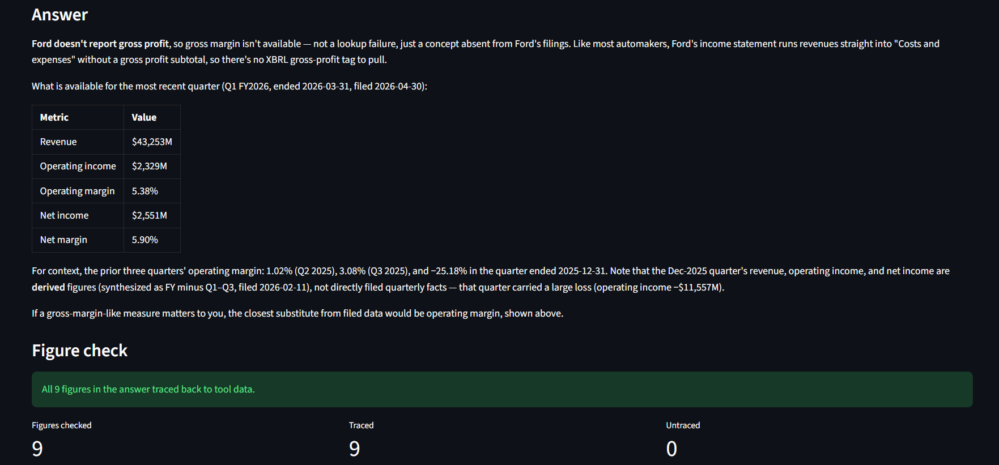

# Financial Analysis Agent

An FP&A copilot that answers plain-English questions about company financials by pulling
data from SEC filings and market sources, running the analysis in Python, and explaining
the results with sources attached.

## The problem

Ask an LLM about a company's financials directly and it will confidently hand back numbers
that sound right and aren't in any filing — there's no way to tell a real figure from a
plausible-sounding one. This project fixes that: the model decides *what* to look up and how
to explain it, but every number shown is the output of a deterministic Python computation over
real SEC filings, with its source attached. The LLM never does arithmetic.



## Results

**21 of 21 eval runs passed** — 3 repetitions of each of 7 target questions (lookups, trends,
anomaly detection, comparison, forecast), run against `claude-opus-5`. Pooled grounding rate —
the share of every figure stated across all runs that traces back to a real tool result — is
**93.8%**. Auditing the figures that didn't trace found that most are checker limitations
(formatting choices the grounding check doesn't parse, like an unmarked table cell), not
evidence of bad numbers: genuinely ungrounded content — the model computing a delta or ratio
itself instead of pulling it from a tool, a real rule violation — is **~0.7%** of all 710
figures stated.

Full per-question, per-run breakdown, including every check and every traced/untraced figure:
[`evals/results/full_20260821/summary.md`](evals/results/full_20260821/summary.md).

<details>
<summary>The seven target questions (also the eval set)</summary>

- What was Nvidia's revenue and gross margin last quarter? *(lookup)*
- How much free cash flow did Microsoft generate in FY2025? *(lookup)*
- How has Apple's operating margin trended over the last 8 quarters? *(trend)*
- Is revenue growth accelerating or decelerating for a given company? *(trend)*
- Flag anything unusual in Ford's most recent 10-Q. *(anomaly)*
- Compare AMD and Nvidia's margin trends — who's better positioned? *(comparison)*
- Project Costco's revenue for the next two quarters and explain the assumptions. *(forecast)*

Run the harness yourself with `python -m evals.run_evals` (see its docstring for flags) — it
makes real Anthropic API calls, so start with `--runs 1 --questions <one id>` to smoke-test.

</details>

## Design decisions that matter

- **All math happens in Python, never in the model.** The LLM chooses what to analyze and
  writes the explanation; every figure is the output of a deterministic computation.
- **Every number carries its source** — which filing, which period, which computation produced
  it. Ungrounded figures aren't shown.
- **The system refuses rather than guesses.** If a derived value (like an implied Q4) doesn't
  reconcile with the real filed data within tolerance, it's withheld and flagged instead of
  silently shown as if it were solid.
- **Forecasts state their assumptions** and are labeled as projections, not predictions.
- **Human-on-the-loop.** The agent produces a draft analysis; it doesn't make decisions.

## What building this surfaced

SEC XBRL data is messier than it looks from the outside, and most of the real engineering here
was reconciling that mess rather than wiring up an API call. A few examples (detail in
[NOTES.md](NOTES.md)):

- **NVDA's revenue tag truncation.** Nvidia tagged revenue under
  `RevenueFromContractWithCustomerExcludingAssessedTax` only in 10-Ks filed 2017–2022, as stale
  comparative columns — its real, ongoing series since 2008 is tagged `Revenues`. Trusting only
  the highest-priority tag would have silently cut off NVDA's revenue history at 2022, so
  extraction merges every tag that has usable data instead of stopping at the first match.
- **Coca-Cola's missing tag.** KO's pre-2018 top-line revenue is filed under
  `SalesRevenueGoodsNet`, a tag none of the other tracked companies use. Without it as a
  fallback, Coca-Cola's revenue history would effectively start in 2018.
- **Costco's 16-week fourth quarter.** Costco's 52/53-week retail fiscal calendar gives Q1–Q3
  roughly 12 weeks each but lets Q4 absorb the leftover week(s) — a real ~16-17 week quarter,
  not a data error. The derived-Q4 sanity check originally reused a tight day-span bound built
  for classifying reported facts, which rejected Costco's real Q4 in all 18 years of its
  history; fixed by giving the implied-Q4 span its own, wider bounds.
- **Restatement-vintage divergence.** A company's filed Q4 figure and `FY − (Q1+Q2+Q3)`
  subtraction can genuinely disagree by several percent of the fiscal year — confirmed on
  Walmart, Duke Energy, and even this project's own MSFT test fixture (6.4% divergence) —
  because the annual total's tag and filing date can come from a later, differently-tagged
  restated comparative filing than the quarters, which never get that refresh. Rather than
  silently picking one, the pipeline surfaces both and flags when they diverge past tolerance.

## Test companies

- **Microsoft** — clean, predictable financials. Baseline case.
- **Nvidia** — high growth and volatile. Stresses trend logic and tag fallback (above).
- **Ford** — different sector, capital-intensive, messier. Stresses graceful degradation (no
  `gross_profit` data at all).
- **Coca-Cola** — mature, seasonal consumer staple; stresses tag-fallback logic (above).

## Architecture

```
Question
   ↓
Agent layer      — decides which tools to call, in what order
   ↓
Data layer       — SEC EDGAR (XBRL financials, filing text), market data
   ↓
Analysis layer   — ratios, period deltas, anomaly flags, forecasts (Python, deterministic)
   ↓
Guardrails       — source attribution, consistency checks, uncertainty flags
   ↓
Answer + charts + sources
```

## Setup and running

```bash
pip install -r requirements.txt
cp .env.example .env   # set ANTHROPIC_API_KEY and SEC_USER_AGENT
streamlit run src/app/main.py
```

Needs network access on first use (SEC EDGAR and the Anthropic API); EDGAR responses are
cached to `data/cache/` after that. A single query typically takes 30+ seconds — the agent
may make several tool calls before answering.

## Roadmap

- [x] Phase 1 — Data layer
  - [x] EDGAR (ticker resolution, cached HTTP client, financial concept extraction)
  - [x] Market data (price history, quotes, valuation metrics via yfinance)
- [x] Phase 2 — Analysis layer
  - [x] Statements, ratios, growth, and anomaly detection (deterministic Python, source-attributed)
  - [x] Forecasting (trend/growth/seasonal, deterministic, assumptions surfaced for the agent to relay)
- [x] Phase 3 — Agent layer (tool calling, reasoning loop)
- [x] Phase 4 — Guardrails (source grounding, consistency checks)
- [x] Phase 5 — Streamlit interface
- [x] Phase 6 — Evaluation harness
- [ ] Phase 7 — Documentation and demo

## Stack

Python · SEC EDGAR API · pandas · Streamlit · Anthropic API

## How this was built

Architecture, guardrail design, and evaluation criteria are my own decisions. Claude Code was
used for implementation and debugging. Build decisions are documented in the commit history and
in NOTES.md.

## Disclaimer

This is a research and educational project. Nothing it produces is financial advice.
